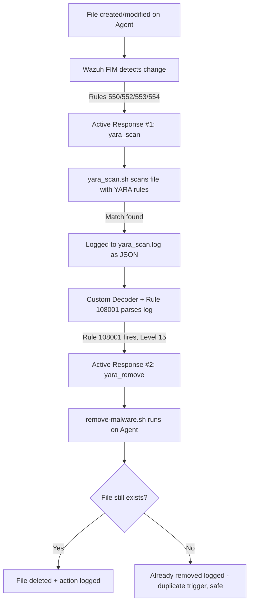

# 🛡️ Wazuh Self-Healing SOC: Automated Malware Remediation with YARA + Active Response

Automatically **detect and delete** malware-infected files the moment Wazuh's YARA integration flags them — no analyst needs to click "remove." This project extends a YARA-based detection pipeline with a fully automated **Active Response** stage that closes the loop from *detection* to *remediation*.

---

## 📌 Overview

Most SOC home-lab setups stop at *detection* — an alert fires, and a human has to go delete the file manually. This project goes one step further and builds the **response** half of detect-and-respond:

> File touched → FIM detects it → YARA scans it → malware confirmed → file auto-deleted → action logged for audit.

All of this happens in a few seconds, with zero manual intervention, and every action is logged for traceability.

---

## 🧠 How It Works (Architecture)



This is a **two-stage Active Response chain**:

| Stage | Trigger | Action | Script |
|---|---|---|---|
| 1. Scan | FIM rule fires (550/552/553/554) | Scan the changed file with YARA | `yara_scan.sh` |
| 2. Remove | YARA detection rule fires (108001) | Delete the confirmed malicious file | `remove-malware.sh` |

---

## ✅ Prerequisites

This guide assumes you already have a **working YARA detection pipeline** in Wazuh, specifically:

- Wazuh Manager + Agent installed and communicating
- YARA installed on the agent, with at least one signature rule set (e.g. the standard EICAR test rule)
- An existing `yara_scan.sh` Active Response script that runs YARA scans and logs JSON results to `/var/ossec/logs/yara_scan.log`
- A custom **decoder + rule** in the Manager that parses that log and fires alerts with **Rule ID `108001`** (Level 15, groups: `yara, malware, malware_detected`) whenever YARA finds a match

> If you haven't built that detection layer yet, that's a separate setup (FIM configuration → YARA install → custom decoder/rule). This document covers **only the auto-remediation stage** that sits on top of it.

---

## ⚙️ Implementation Steps

### Step 1 — Register the Active Response Command (on the Manager)

Active Response in Wazuh works in two parts: a `<command>` block (which *names* a script) and an `<active-response>` block (which *binds* that command to a rule). Edit the manager's config:

```bash
sudo nano /var/ossec/etc/ossec.conf
```

Add this **below your existing `yara_scan` blocks** (do not delete those — they are a separate, earlier stage in the same chain):

```xml
<!-- Stage 2: Auto-delete the file once YARA confirms malware -->
<command>
  <name>yara_remove</name>
  <executable>remove-malware.sh</executable>
  <timeout_allowed>no</timeout_allowed>
</command>

<active-response>
  <command>yara_remove</command>
  <location>local</location>
  <rules_id>108001</rules_id>
</active-response>
```

**Why this works:** Wazuh allows multiple `<command>` + `<active-response>` pairs in the same config, as long as each `<command>` has a unique `<name>`. Here, `yara_remove` is bound specifically to **rule 108001** — the rule that fires only when YARA has *already confirmed* a malware match. This keeps the "scan" and "remove" stages cleanly separated.

---

### Step 2 — Create the Removal Script (on the Agent)

```bash
sudo nano /var/ossec/active-response/bin/remove-malware.sh
```

```bash
#!/bin/bash

LOG_FILE="/var/ossec/logs/active-responses.log"
read INPUT_JSON

# Extract the malicious file path using sed, NOT jq.
# Reason: Wazuh's alert JSON embeds the raw log line inside "full_log" with
# unescaped inner quotes, which makes the overall JSON technically invalid.
# Strict parsers like jq fail silently on this and return nothing.
# sed pattern-matches the specific "data":{"yara":{...,"file":"..."} segment
# directly, so it works regardless of the full_log formatting issue.
MALWARE_FILE=$(echo "$INPUT_JSON" | sed -n 's/.*"data":{"yara":{"scan":"[^"]*","matched_rule":"[^"]*","file":"\([^"]*\)".*/\1/p')

# Decode URL-encoded characters in the path (e.g. %3A, %2F)
MALWARE_FILE=$(python3 -c "import urllib.parse,sys; print(urllib.parse.unquote(sys.argv[1]))" "$MALWARE_FILE")

if [ -n "$MALWARE_FILE" ] && [ -f "$MALWARE_FILE" ]; then
    rm -f "$MALWARE_FILE"
    echo "$(date) - Deleted malicious file: $MALWARE_FILE" >> "$LOG_FILE"
elif [ -z "$MALWARE_FILE" ]; then
    echo "$(date) - ERROR: Could not extract file path from JSON" >> "$LOG_FILE"
else
    echo "$(date) - File not found (already removed?): $MALWARE_FILE" >> "$LOG_FILE"
fi

exit 0
```

**Why each part matters:**
- `read INPUT_JSON` — Wazuh sends the full alert as JSON via **stdin**, not as a command-line argument. This is how every Active Response script receives its data.
- The `sed` extraction — explained above; it's the fix for the malformed-JSON issue.
- The Python one-liner — decodes URL-encoded paths (some file paths get percent-encoded by upstream tools like file indexers).
- The `[ -f "$MALWARE_FILE" ]` check — YARA can sometimes fire the same rule twice in quick succession for one file (duplicate signature matches). This check makes the second run a harmless no-op instead of an error.

---

### Step 3 — Set Correct Permissions

```bash
sudo chmod 750 /var/ossec/active-response/bin/remove-malware.sh
sudo chown root:wazuh /var/ossec/active-response/bin/remove-malware.sh
```

**Why:** Everything under `/var/ossec/` is owned by `root:wazuh` and tightly permissioned by design — a normal user account cannot create or modify files there directly. `750` ensures only `root` and the `wazuh` group can execute it, since this script has the power to delete files.

---

### Step 4 — Validate the Configuration

```bash
sudo /var/ossec/bin/wazuh-control configtest
```

**Why:** A single XML mistake (unclosed tag, duplicate `<name>`) can cause `wazuh-manager` to fail on restart, or worse, silently ignore the active-response section. Always run this *before* restarting.

---

### Step 5 — Restart Manager and Agent

```bash
# On the Manager
sudo systemctl restart wazuh-manager

# On the Agent
sudo systemctl restart wazuh-agent
```

Config changes to `ossec.conf` are only loaded on restart — skipping this step is the most common reason an Active Response "doesn't seem to fire."

---

### Step 6 — Test End-to-End

```bash
echo 'X5O!P%@AP[4\PZX54(P^)7CC)7}$EICAR-STANDARD-ANTIVIRUS-TEST-FILE!$H+H*' > /home/youruser/eicar-test.txt
```

Watch the response happen live:

```bash
sudo tail -f /var/ossec/logs/active-responses.log
```

Then confirm the file is actually gone:

```bash
ls -la /home/youruser/eicar-test.txt
```

Expected result: log shows `Deleted malicious file: ...` and the `ls` command reports `No such file or directory`.

---

## 🔍 Verifying It Works (Quick Checklist)

- [ ] `tail -f /var/ossec/logs/active-responses.log` shows a "Deleted" entry
- [ ] The test file no longer exists on disk
- [ ] `grep "yara_remove" /var/ossec/logs/ossec.log` shows the manager dispatching the command
- [ ] Rule 108001 alert appears in the Wazuh dashboard around the same timestamp

---

## ⚠️ Production Considerations

- **Quarantine instead of delete:** In a production environment, consider `mv`-ing the file to a restricted quarantine directory instead of `rm -f`. This gives you a recovery path if a detection is ever a false positive, while still neutralizing the threat (file is moved out of any executable/served location).
- **Alert noise:** If you notice the same file triggering the remove action twice in a row, that's expected — it usually means two YARA signatures matched the same file. It's logged as a harmless "already removed" event, not an error.
- **Don't remove the debug line until you've confirmed it works once** — if you're setting this up fresh, keep `echo "$INPUT_JSON" >> /tmp/ar_debug.log` in the script temporarily to inspect the real alert JSON your Wazuh version sends, then remove it once confirmed (it's already removed from the script above for the production version).

---

## 📂 Suggested Repository Structure

```
wazuh-yara-auto-remediation/
├── README.md
├── scripts/
│   └── remove-malware.sh
├── config/
│   └── active-response-ossec-snippet.xml
└── screenshots/
    ├── alert-dashboard.png
    └── active-response-log.png
```

---

## 🧰 Tech Stack

`Wazuh` · `YARA` · `Bash` · `Python (urllib)` · `Linux (Ubuntu Server)`

---

## 👤 Author

**Rakibul Islam Joy** — Security Engineer (SOC) | Building hands-on detection & automated response labs
[LinkedIn](https://linkedin.com/in/rakibul-islam-joy-4166a3242) · [GitHub](https://github.com/rakibuljoy)
